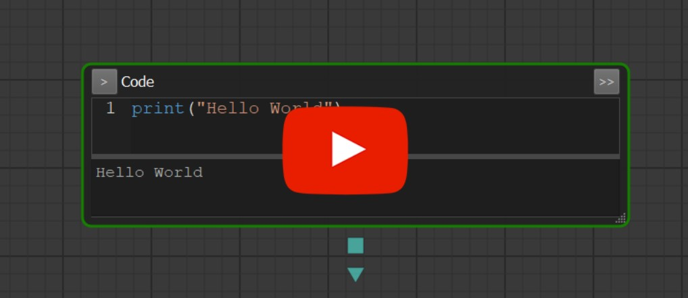
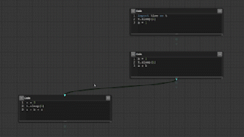
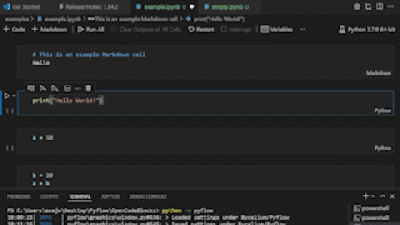

# PyFlow

PyFlow is an open-source graph-structured interactive Python development tool

  

Check out this quick video comparing features between Pyflow to Jupyter:

  

## Features
-   Create blocks of code in which you can edit and run Python code

  

-   Move and resize blocks on an infinite 2D plane

  

-   Link blocks to highlight dependencies, Pyflow will then automatically run your blocks in the correct order

  

-   Convert your Jupyter notebooks to Pyflow graphs and vice versa

  

## Installation
Make sure you have Python 3 installed. Tested with 3.11

### Install PyFlow on Windows
 

 install.bat

See [SHORTCUTS.md](SHORTCUTS.md) for a better experience.

## License
See [LICENSE](LICENSE)
